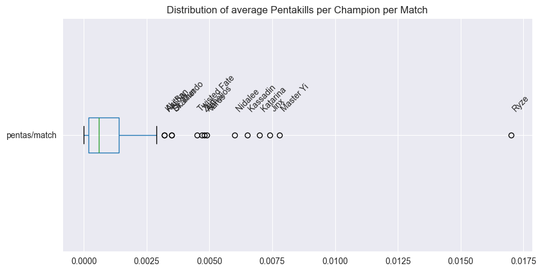
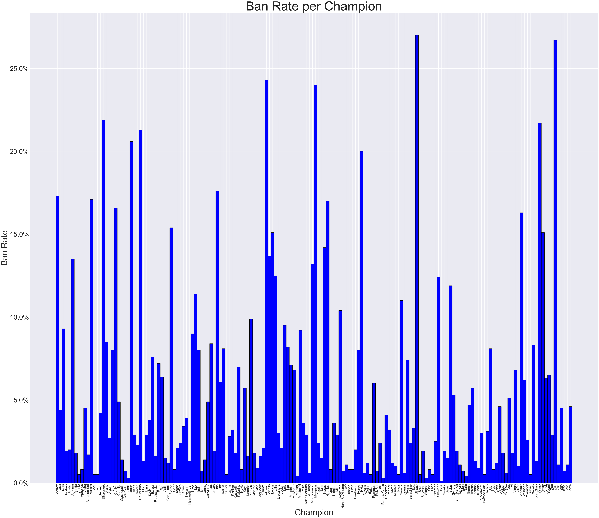
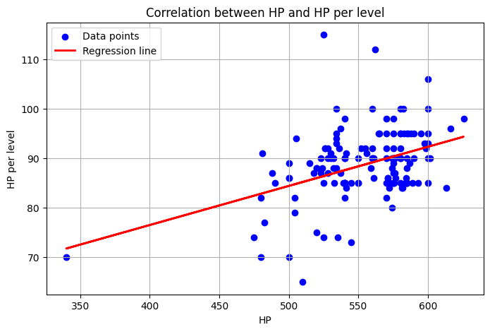
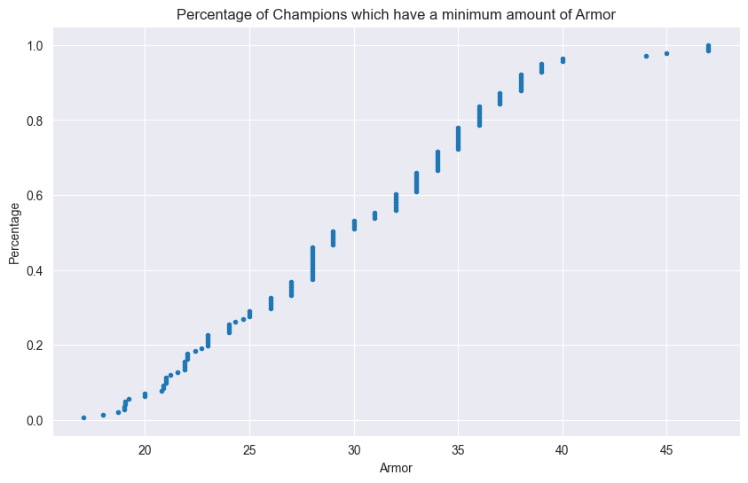
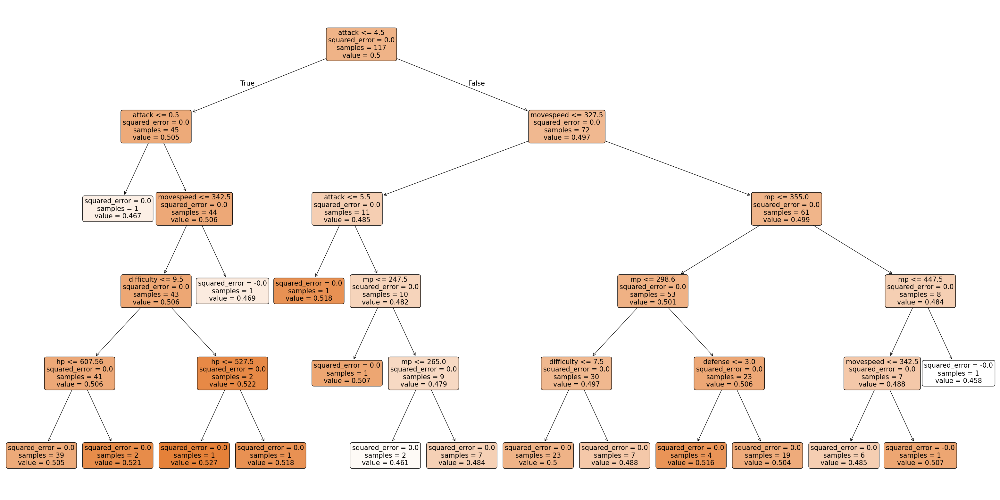
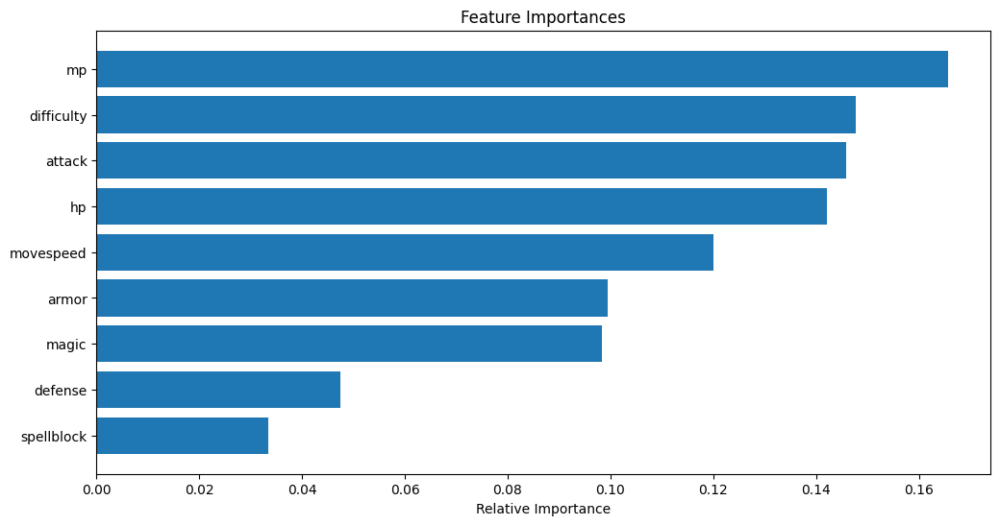

# League Of Legends Champions Analysis Documentation
This is the documentation to the Analysis of League Of Legends Champions & their traits. 
The functionality used for the analysis has been implemented with Python & Jupyter Notebook.

For the remaining of this documentation, the following code snippet will be used as a base for all the following code examples:

```python
import pandas as pandas
import numpy as numpy

import matplotlib.pyplot as plot
import matplotlib.ticker as ticker

from sklearn.linear_model import LinearRegression
from scipy.stats import linregress

champions = pandas.read_csv('datasets/Combined Traits.csv')

pandas.set_option('display.max_rows', None)

print(champions)
```

## 1. Table of Contents

  - [Origin & Specifications](#2-origin--specifications)
  - [Research Questions](#3-research-questions)
  - [Basic Plots](#3-basic-plots)
  - [Decision Tree & Random Forest](#4-decision-tree--random-forest)
  - [Linear Model Comparison](#5-linear-model-comparison)
  - [Performance](#6-performance)

## 2. Origin & Specifications

## 3. Research Questions

## 3. Basic Plots

### 3.1. Boxplot

The Boxplot visualizes how the amount of Pentakills per match are distributed among Champions: 

```python
plot.figure(figsize=(10, 5))
plot.title('Disribution of average Pentakills per Champion per Match')

boxplot = champions.boxplot(column=['pentas/match'], vert=False)

Q1 = champions['pentas/match'].quantile(0.25)
Q3 = champions['pentas/match'].quantile(0.75)
IQR = Q3 - Q1
outliers = champions[(champions['pentas/match'] < (Q1 - 1.5 * IQR)) | (champions['pentas/match'] > (Q3 + 1.5 * IQR))]

for i in range(outliers.shape[0]):
    plot.annotate(outliers['name'].iloc[i],
                  xy=(outliers['pentas/match'].iloc[i], 1),
                  xytext=(outliers['pentas/match'].iloc[i], 1.1),
                  rotation=45)
    
plot.show()
```



The Boxplot orients around the Median of around 0.005 Pentakills per match, whereas the first quartile is around 0.0002 Pentakills per match and the third quartile is around 0.00125 Pentakills per match. The Boxplot ranges from 0 to 0.0025 Pentakills per match.

It can be seen that generally most champions have a low amount of Pentakills per match, with a handful of outliers having a substantially higher amount of Pentakills per match, especilly the Champion Ryze which peaks with around 0.0175 Pentakills per match. The other outliers lie in the range of around 0.003 to 0.008 Pentakills per match.

### 3.1. Histogram

The Histogram visualizes the average Banrate per Champion:

```python
plot.figure(figsize=(60, 50))
plot.bar(champions['name'], champions['banrate'], color='blue', edgecolor='black', width=1)

plot.title('Ban Rate per Champion', fontsize=75)
plot.xlabel('Champion', fontsize=50)
plot.ylabel('Ban Rate', fontsize=50)
plot.xticks(rotation=90, fontsize=20)
plot.yticks(fontsize=40)
plot.gca().yaxis.set_major_formatter(ticker.PercentFormatter(1.0))

plot.show()
```



The Y-Axis which displays the Banrate is formatted as a percentage, ranging from 0% to 30% in the Histogram. The X-Axis displays the Champions. The Banrate of each Champion is displayed as a blue bar, with the height of the bar representing the Banrate of the Champion.

It can be seen that there is generally a lot of variation in the Banrate of the Champions, with some Champions having a Banrate of 0% and others peaking at a Banrate of around 30%, namely Zed and Shaco.

### 3.1. Scatterplot with Regression

The Scatterplot along with its regression line visualizes the correlation between the amount of HP (Health Points) per champion and the amount new HP gained per level:

```python
champions = champions.dropna()

x = champions['hp'].values.reshape(-1, 1)
y = champions['hpperlevel'].values

plot.figure(figsize=(8, 5))
plot.scatter(x, y, color='blue', label='Data points')

regressor = LinearRegression()
regressor.fit(x, y)
y_pred = regressor.predict(x)

plot.plot(x, y_pred, color='red', linewidth=2, label='Regression line')

plot.xlabel('HP')
plot.ylabel('Attack')
plot.title('Correlation between HP and HP per level')
plot.legend(loc='upper left')
plot.grid(True)

plot.show()
```



The Y-Axis displays the amount of HP gained per level which ranges from 0 to around 130. The X-Axis displays the amount of HP which ranges from 0 to around 600. 

It can be seen that most of the observations are clustered around the upper right area of the plot. The regression line indicates a positive correlation between the amount of HP and the amount of HP gained per level. The regression line is slightly inclined, indicating a positive correlation between the two variables. 

Analyzing Pearson's Correlation Coefficient (r=0.224...), it is safe to say that there is no meaningful correlation between the two variables.

### 3.1. Cumulative Distribution Function

The Cumulative Distribution Function visualizes the percentage of champions that have a certain amount of Armor at maximum:

```python
armorSorted = champions['armor'].sort_values()

cdf = numpy.arange(1, len(armorSorted) + 1) / len(armorSorted)

slope, intercept, r_value, p_value, std_err = linregress(armorSorted, cdf)

regressionLine = slope * armorSorted + intercept

plot.figure(figsize=(10, 6))
plot.plot(armorSorted, cdf, marker='.', linestyle='none')
plot.plot(armorSorted, regressionLine, label='Regression Line', linestyle='--', linewidth=2, color='red')
plot.xlabel('Armor')
plot.ylabel('Percentage')
plot.title('Percentage of Champions which have a minimum amount of Armor')
plot.legend()
plot.grid(True)
plot.show()
```



The Y-Axis displays the percentage of Champions which have a certain maximum amount of Armor, ranging from 0% to 100% (or 0-1). The X-Axis displays the amount of Armor, ranging from 0 to around 50.

The expected value lies around 0.5, indicating that around 50% of the Champions have an around 30 Armor at Maximum. Most Champions generally lie around the 25-40 Armor range.

## 4. Decision Tree & Random Forest

### 4.1 Decision Tree

The Decision Tree visualizes the correlation between the most important features of the Champions and their Winrate, by using the Mean Squared Error of the calculated regression as the decision criterion:

```python
features = ['attack', 'defense', 'magic', 'difficulty','hp', 'mp', 'movespeed', 'armor', 'spellblock']
target = 'winrate'

champions = champions.dropna(subset=features + [target])

X = champions[features]
Y = champions[target]

X_train, X_test, Y_train, Y_test = train_test_split(X, Y, test_size=0.2, random_state=42)

regressionTree = DecisionTreeRegressor(max_depth=5, random_state=42)
regressionTree.fit(X_train, Y_train)

print("Train R^2:", regressionTree.score(X_train, Y_train))
print("Test R^2:", regressionTree.score(X_test, Y_test))

plot.figure(figsize=(40, 20))
plot_tree(regressionTree, feature_names=features, filled=True, rounded=True)
plot.show()
```



The Tree only goes down to level 5 as the maximum depth is set to 5. Analyzing the Decision Points of the Tree, it can be seen that the Mean Squared Error is 0 for every decision. This means that the Decision Tree has made its prediction with 100% Accuracy and is thus not able to make any meaningful decisions based on the features provided. 

This Problem presumably exits due to the fact that the Decision Tree is overfitting the Data, which is probably due to the small Size of the Dataset.

### 4.2 Random Forest

The Random Forest calculates the correlation between the most important features of the Champions and their Winrate. The Feature Importance Plot visualizes the importance of each feature, based on the calculations made by the random Forest:

```python
features = ['attack', 'defense', 'magic', 'difficulty','hp', 'mp', 'movespeed', 'armor', 'spellblock']
target = 'winrate'

champions = champions.dropna(subset=features + [target])

X = champions[features]
Y = champions[target]

scaler = StandardScaler()
X_scaled = scaler.fit_transform(X)

X_train, X_test, Y_train, Y_test = train_test_split(X_scaled, Y, test_size=0.2, random_state=42)

rf_model = RandomForestRegressor(n_estimators=100, max_depth=5, random_state=42)
rf_model.fit(X_train, Y_train)

print("Train R^2:", rf_model.score(X_train, Y_train))
print("Test R^2:", rf_model.score(X_test, Y_test))

importances = rf_model.feature_importances_
indices = importances.argsort()

plot.figure(figsize=(12, 6))
plot.title("Feature Importances")
plot.barh(range(len(indices)), importances[indices], align="center")
plot.yticks(range(len(indices)), [features[i] for i in indices])
plot.xlabel("Relative Importance")
plot.show()
```

It can be seen the most important features are 'mp', 'difficulty', 'attack' and 'hp' in descending order.



## 5. Linear Model Comparison

## 6. Performance