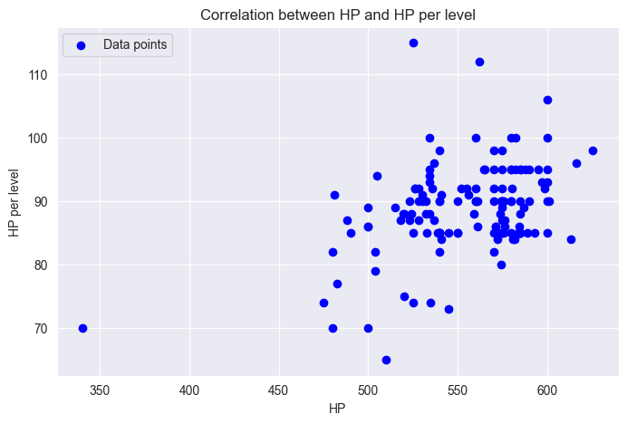
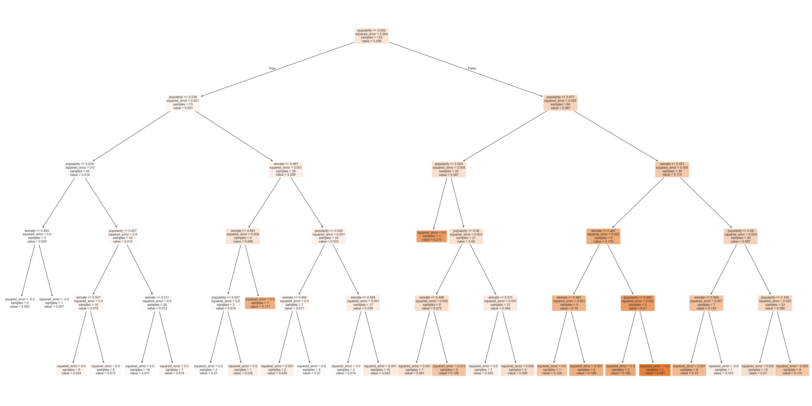

# League Of Legends Champions Analysis Documentation

This is the documentation to the Analysis of League Of Legends Champions & their traits. 

The functionality used for the analysis has been implemented with Python & Jupyter Notebook.

## 1. Table of Contents

  - [Generics](#2-generics)
  - [Research Questions](#3-research-questions)
  - [Basic Plots](#4-basic-plots)
  - [Decision Tree & Random Forest](#5-decision-tree--random-forest)
  - [Linear Model Comparison](#6-linear-model)
  - [Evaluation](#7-evaluation)

## 2. Generics

### 2.1 Definitions

League of Legends features is a video game (MOBA) with playable characters called champions. Players use these champions to fight against each other in 5 vs 5 battles. Before the game begins players first ban champions they don't want to see and then select their preferred champions. These decisions are saved in ban rate and popularity respectively. Winrate is the measure of how many games are won with the champion on the team.

For the remaining of this documentation, the following code snippet will be used as a base for all the following code examples:

```python
import pandas
import seaborn
import numpy

import matplotlib.pyplot as plot
import matplotlib.ticker as ticker

from sklearn.model_selection import train_test_split
from sklearn.tree import DecisionTreeRegressor, plot_tree
from sklearn.linear_model import LinearRegression
from sklearn.ensemble import RandomForestRegressor
from sklearn.metrics import mean_squared_error, r2_score

champions = pandas.read_csv('datasets/Combined Traits.csv')

pandas.set_option('display.max_rows', None)

print(champions)
```

### 2.2 Origin

The Datasets originate from Kaggle and are publicly available: 

- Generic Champions Data: https://www.kaggle.com/datasets/cutedango/league-of-legends-champions
- Specific Champions Data: https://www.kaggle.com/datasets/delfinaoliva/league-of-legends-champspopularity-winrate-kda

### 2.3 Specification

The Datasets have been combined into one Dataset, which contains 168 rows (Champions) and 45 columns (features). Furthermore, the combined Dataset has been refined and redundant or irrelevant columns have been removed.

Both of the Datasets have been combined into one Dataset, which contains the following columns:

- Name: The name of the League of Legends champion
- Role: The primary role or a position played by the champion. 
- Range type: Wether the champion is melee or ranged
- Resourse type: The resource that a champion can generate and consume when using abilities or a basic attack
- Base HP: The champions base health points (HP) at lvl 1
- HP per lvl: The amount of hp the champion gains per lvl
- Base mana: The champion's base mana points at level 1.
- Mana per lvl: The amount of mana points (MP) the champion gains per level.
- Movement speed: The champion's base movement speed.
- Base armor: The champion's base armor at level 1.
- Armor per lvl: The amount of armor the champion gains per level.
- Base magic resistance: The champion's base magic resistance at level 1.
- Magic resistance per lvl: The amount of magic resistance the champion gains per level.
- Attack range: The range of the champion's basic attacks.
- HP regeneration: Determines the rate that a unit's current health passively regenerates, measured per 5 seconds
- HP regeneration per lvl: The amount of health regeneration the champion gains per level.
- Mana regeneration: Determines the rate that a unit's current mana passively regenerates, measured per 5 seconds
- Mana regeneration per lvl: The amount of mana regeneration the champion gains per level.
- Attack damage: The champion's base attack damage at level 1.
- Attack damage per lvl: The amount of attack damage the champion gains per level.
- Attack speed per lvl: The amount of attack speed the champion gains per level, (%).
- Attack speed: The champion's base attack speed (AS).
- AS ratio: Adjusts the effectiveness of bonus AS from all sources.

### 2.3.1 Correlation

The Heatmap visualizes the correlations between each two features of the Champions:

```python
numeric_columns = champions.select_dtypes(include=[numpy.number]).columns

champions[numeric_columns] = champions[numeric_columns].apply(pandas.to_numeric, errors='coerce')
champions = champions.dropna(subset=numeric_columns)

correlation_matrix = champions[numeric_columns].corr()

plot.figure(figsize=(20, 16))

heatmap = seaborn.heatmap(correlation_matrix, fmt=".3f", annot=True, cmap='coolwarm', linewidths=0.5, annot_kws={"size": 10})

colorbar = heatmap.collections[0].colorbar
colorbar.ax.tick_params(labelsize=18)

plot.title('Correlation Heatmap', fontsize=30)
plot.xticks(fontsize=20)
plot.yticks(fontsize=20)
plot.show()
```

## 3. Research Questions

  1. How well can you predict ```attackdamageperlevel``` using ```attackdamage```?
  2. How well can you predict ```banrate``` using ```winrate``` and ```popularity```?

## 4. Basic Plots

### 4.1. Boxplot

The Boxplot visualizes how the amount of Pentakills per match are distributed among Champions: 

```python
plot.figure(figsize=(10, 5))
plot.title('Distribution of average Pentakills per Champion per Match')

boxplot = champions.boxplot(column=['pentas/match'], vert=False)

Q1 = champions['pentas/match'].quantile(0.25)
Q3 = champions['pentas/match'].quantile(0.75)
IQR = Q3 - Q1
outliers = champions[(champions['pentas/match'] < (Q1 - 1.5 * IQR)) | (champions['pentas/match'] > (Q3 + 1.5 * IQR))]

for i in range(outliers.shape[0]):
    plot.annotate(outliers['name'].iloc[i],
                  xy=(outliers['pentas/match'].iloc[i], 1),
                  xytext=(outliers['pentas/match'].iloc[i], 1.1),
                  rotation=45)
    
plot.show()
```


The Boxplot orients around the Median of around 0.005 Pentakills per match, whereas the first quartile is around 0.0002 Pentakills per match and the third quartile is around 0.00125 Pentakills per match. The Boxplot ranges from 0 to 0.0025 Pentakills per match.

It can be seen that generally most champions have a low amount of Pentakills per match, with a handful of outliers having a substantially higher amount of Pentakills per match, especilly the Champion Ryze which peaks with around 0.0175 Pentakills per match. The other outliers lie in the range of around 0.003 to 0.008 Pentakills per match.

### 4.2. Histogram

The Histogram visualizes the average Banrate per Champion:

```python
plot.figure(figsize=(60, 50))
plot.bar(champions['name'], champions['banrate'], color='blue', edgecolor='black', width=1)

plot.title('Ban Rate per Champion', fontsize=75)
plot.xlabel('Champion', fontsize=50)
plot.ylabel('Ban Rate', fontsize=50)
plot.xticks(rotation=90, fontsize=20)
plot.yticks(fontsize=40)
plot.gca().yaxis.set_major_formatter(ticker.PercentFormatter(1.0))

plot.show()
```


The Y-Axis which displays the Banrate is formatted as a percentage, ranging from 0% to 30% in the Histogram. The X-Axis displays the Champions. The Banrate of each Champion is displayed as a blue bar, with the height of the bar representing the Banrate of the Champion.

It can be seen that there is generally a lot of variation in the Banrate of the Champions, with some Champions having a Banrate of 0% and others peaking at a Banrate of around 30%, namely Zed and Shaco.

### 4.3. Scatterplot with Regression

The Scatterplot along with its regression line visualizes the correlation between the amount of HP (Health Points) per champion and the amount new HP gained per level:

```python
champions = champions.dropna()

x = champions['hp'].values.reshape(-1, 1)
y = champions['hpperlevel'].values

plot.figure(figsize=(8, 5))
plot.scatter(x, y, color='blue', label='Data points')
plot.xlabel('HP')
plot.ylabel('HP per level')
plot.title('Correlation between HP and HP per level')
plot.legend(loc='upper left')
plot.grid(True)

plot.show()
```



The Y-Axis displays the amount of HP gained per level which ranges from 0 to around 130. The X-Axis displays the amount of HP which ranges from 0 to around 600. 

It can be seen that most of the observations are clustered around the upper right area of the plot. The regression line indicates a positive correlation between the amount of HP and the amount of HP gained per level. The regression line is slightly inclined, indicating a positive correlation between the two variables. 

Analyzing Pearson's Correlation Coefficient (r=0.224...), it is safe to say that there is no meaningful correlation between the two variables.

### 4.4. Cumulative Distribution Function

The Cumulative Distribution Function visualizes the percentage of champions that have a certain amount of Armor at maximum:

```python
armorSorted = champions['armor'].sort_values()

cdf = numpy.arange(1, len(armorSorted) + 1) / len(armorSorted)

plot.figure(figsize=(10, 6))
plot.plot(armorSorted, cdf, marker='.', linestyle='none')
plot.xlabel('Armor')
plot.ylabel('Percentage')
plot.title('Percentage of Champions which have a minimum amount of Armor')
plot.grid(True)
plot.show()
```


The Y-Axis displays the percentage of Champions which have a certain maximum amount of Armor, ranging from 0% to 100% (or 0-1). The X-Axis displays the amount of Armor, ranging from 0 to around 50.

The expected value lies around 0.5, indicating that around 50% of the Champions have an around 30 Armor at Maximum. Most Champions generally lie around the 25-40 Armor range.

## 5. Linear Regression

```python
features = ['attackdamage']
target = 'attackdamageperlevel'

champions = champions.dropna(subset=features + [target])

X = champions[features]
Y = champions[target]

X_train, X_test, Y_train, Y_test = train_test_split(X, Y, test_size=0.2, random_state=42)

linear = LinearRegression()
linear.fit(X_train, Y_train)

Y_prediction = linear.predict(X_test)

print("Determination Coefficient (R^2):", r2_score(Y_test, Y_prediction))
print("Mean Square Error (MSE):", mean_squared_error(Y_test, Y_prediction))
```

```python
features = ['popularity', 'winrate']
target = 'banrate'

champions = champions.dropna(subset=features + [target])

X = champions[features]
Y = champions[target]

X_train, X_test, Y_train, Y_test = train_test_split(X, Y, test_size=0.2, random_state=42)

linear = LinearRegression()
linear.fit(X_train, Y_train)

Y_prediction = linear.predict(X_test)

print("Determination Coefficient (R^2):", r2_score(Y_test, Y_prediction))
print("Mean Square Error (MSE):", mean_squared_error(Y_test, Y_prediction))
```

## 6. Decision Trees & Random Forests

### 6.1 Decision Trees

The first Decision Tree visualizes the correlation between the most important features of the Champions and their Winrate, by using the Mean Squared Error of the calculated regression as the decision criterion:

```python
features = ['attackdamage']
target = 'attackdamageperlevel'

champions = champions.dropna(subset=features + [target])

X = champions[features]
Y = champions[target]

X_train, X_test, Y_train, Y_test = train_test_split(X, Y, test_size=0.2, random_state=42)

regressionTree = DecisionTreeRegressor(max_depth=5, random_state=42)
regressionTree.fit(X_train, Y_train)

Y_train_pred = regressionTree.predict(X_train)
Y_test_pred = regressionTree.predict(X_test)

X_full = numpy.concatenate([X_train, X_test])
Y_full = numpy.concatenate([Y_train, Y_test])

Y_pred_full = regressionTree.predict(X_full)

Y_combined = numpy.concatenate([Y_train, Y_test])
Y_combined_pred = numpy.concatenate([Y_train_pred, Y_test_pred])

TrainR2 = regressionTree.score(X_train, Y_train)
TestR2 = regressionTree.score(X_test, Y_test)
OverallR2 = r2_score(Y_full, Y_pred_full)

TrainMSE = mean_squared_error(Y_train, Y_train_pred)
TestMSE = mean_squared_error(Y_test, Y_test_pred)
OverallMSE = mean_squared_error(Y_combined, Y_combined_pred)

print("Train Determination Coefficient (R^2):", TrainR2)
print("Test Determination Coefficient (R^2):", TestR2)
print("Overall Determination Coefficient (R^2):", OverallR2)

print("Train Mean Squared Error (MSE):", TrainMSE)
print("Test Mean Squared Error (MSE):", TestMSE)
print("Overall Mean Squared Error (MSE):", OverallMSE)

plot.figure(figsize=(40, 20))
plot_tree(regressionTree, feature_names=features, filled=True, rounded=True)
plot.show()
```


The second Decision Tree visualizes the correlation between the most important features of the Champions and their Winrate, by using the Mean Squared Error of the calculated regression as the decision criterion:

```python
features = ['popularity', 'winrate']
target = 'banrate'

champions = champions.dropna(subset=features + [target])

X = champions[features]
Y = champions[target]

X_train, X_test, Y_train, Y_test = train_test_split(X, Y, test_size=0.2, random_state=42)

regressionTree = DecisionTreeRegressor(max_depth=5, random_state=42)
regressionTree.fit(X_train, Y_train)

Y_train_pred = regressionTree.predict(X_train)
Y_test_pred = regressionTree.predict(X_test)

X_full = numpy.concatenate([X_train, X_test])
Y_full = numpy.concatenate([Y_train, Y_test])

Y_pred_full = regressionTree.predict(X_full)

Y_combined = numpy.concatenate([Y_train, Y_test])
Y_combined_pred = numpy.concatenate([Y_train_pred, Y_test_pred])

TrainR2 = regressionTree.score(X_train, Y_train)
TestR2 = regressionTree.score(X_test, Y_test)
OverallR2 = r2_score(Y_full, Y_pred_full)

TrainMSE = mean_squared_error(Y_train, Y_train_pred)
TestMSE = mean_squared_error(Y_test, Y_test_pred)
OverallMSE = mean_squared_error(Y_combined, Y_combined_pred)

print("Train Determination Coefficient (R^2):", TrainR2)
print("Test Determination Coefficient (R^2):", TestR2)
print("Overall Determination Coefficient (R^2):", OverallR2)

print("Train Mean Squared Error (MSE):", TrainMSE)
print("Test Mean Squared Error (MSE):", TestMSE)
print("Overall Mean Squared Error (MSE):", OverallMSE)

plot.figure(figsize=(40, 20))
plot_tree(regressionTree, feature_names=features, filled=True, rounded=True)
plot.show()
```



The Trees only goes down to level 5 as the maximum depth is set to 5. Analyzing the Decision Points of the Tree, it can be seen that the Mean Squared Error is 0 for every decision. This means that the Decision Tree has made its prediction with 100% Accuracy and is thus not able to make any meaningful decisions based on the features provided. 

This Problem presumably exits due to the fact that the Decision Tree is overfitting the Data, which is probably due to the small Size of the Dataset.

### 6.2 Random Forest

The Random Forest calculates the correlation between the most important features of the Champions and their Winrate. The Feature Importance Plot visualizes the importance of each feature, based on the calculations made by the random Forest:

```python
ffeatures = ['attackdamage']
target = 'attackdamageperlevel'

champions = champions.dropna(subset=features + [target])

X = champions[features]
Y = champions[target]

X_train, X_test, Y_train, Y_test = train_test_split(X, Y, test_size=20, random_state=42)

randomForest = RandomForestRegressor(n_estimators=100, random_state=42)
randomForest.fit(X_train, Y_train)

Y_train_pred = randomForest.predict(X_train)
Y_test_pred = randomForest.predict(X_test)

Y_combined = numpy.concatenate([Y_train, Y_test])
Y_combined_pred = numpy.concatenate([Y_train_pred, Y_test_pred])

TrainR2 = randomForest.score(X_train, Y_train)
TestR2 = randomForest.score(X_test, Y_test)

TrainMSE = mean_squared_error(Y_train, Y_train_pred)
TestMSE = mean_squared_error(Y_test, Y_test_pred)
OverallMSE = mean_squared_error(Y_combined, Y_combined_pred)

print("Train Determination Coefficient (R^2):", TrainR2)
print("Test Determination Coefficient (R^2):", TestR2)
print("Overall Determination Coefficient (R^2):", r2_score(Y_combined, Y_combined_pred))
print("Train Mean Squared Error (MSE):", TrainMSE)
print("Test Mean Squared Error (MSE):", TestMSE)
print("Overall Mean Squared Error (MSE):", OverallMSE)

importances = randomForest.feature_importances_
indices = importances.argsort()
```

```python
features = ['popularity', 'winrate']
target = 'banrate'

champions = champions.dropna(subset=features + [target])

X = champions[features]
Y = champions[target]

X_train, X_test, Y_train, Y_test = train_test_split(X, Y, test_size=20, random_state=42)

randomForest = RandomForestRegressor(n_estimators=100, random_state=42)
randomForest.fit(X_train, Y_train)

Y_train_pred = randomForest.predict(X_train)
Y_test_pred = randomForest.predict(X_test)

Y_combined = numpy.concatenate([Y_train, Y_test])
Y_combined_pred = numpy.concatenate([Y_train_pred, Y_test_pred])

TrainR2 = randomForest.score(X_train, Y_train)
TestR2 = randomForest.score(X_test, Y_test)

TrainMSE = mean_squared_error(Y_train, Y_train_pred)
TestMSE = mean_squared_error(Y_test, Y_test_pred)
OverallMSE = mean_squared_error(Y_combined, Y_combined_pred)

print("Train Determination Coefficient (R^2):", TrainR2)
print("Test Determination Coefficient (R^2):", TestR2)
print("Overall Determination Coefficient (R^2):", r2_score(Y_combined, Y_combined_pred))
print("Train Mean Squared Error (MSE):", TrainMSE)
print("Test Mean Squared Error (MSE):", TestMSE)
print("Overall Mean Squared Error (MSE):", OverallMSE)

importances = randomForest.feature_importances_
indices = importances.argsort()

plot.figure(figsize=(12, 6))
plot.title("Feature Importances")
plot.barh(range(len(indices)), importances[indices], align="center")
plot.yticks(range(len(indices)), [features[i] for i in indices])
plot.xlabel("Relative Importance")
plot.show()
```


It can be seen the most important feature is ```popularity```, rather than ```winrate```.

## 7. Evaluation

The aforementioned regressions, decision trees and random forests have been calculated and returned the following results:

| Model             | Research Question | Determination Coefficient (R^2) | Mean Square Error           | Overall Performance |
|--------------------|-------------------|----------------------------------|-----------------------------|---------------------|
| Regression 1      | 1                 | 0.1476228551800477              | 0.21927787191177023         | Very Bad            |
| Regression 2      | 2                 | 0.24931904093175195             | 0.0032800134216433487       | Bad                 |
| Decision Tree 1   | 1                 | 0.9373363137833869              | 0.323292309352005           | Good                |
| Decision Tree 2   | 2                 | 0.5585842790318705              | 0.0016353170901722662       | Very Good           |
| Random Forest 1   | 1                 | 0.8469561365943215              | 0.7895785744480707          | Good                |
| Random Forest 2   | 2                 | 0.7820364760910814              | 0.0008074915748371392       | Very Good           |
